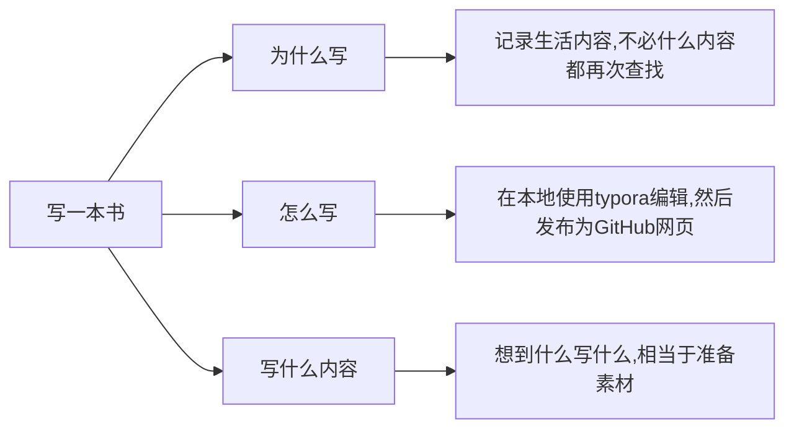

# blog

start！

hello world！

```mermaid
graph LR;
%%此处为注释
写一本书-->为什么写; 
写一本书-->怎么写;
写一本书-->写什么内容;
为什么写-->记录生活内容,不必什么内容都再次查找;
怎么写-->在本地使用typora编辑,然后发布为GitHub网页;
写什么内容-->想到什么写什么,相当于准备素材;
```

<!-- 加载mermaid，以便GitHub page 展示mermaid -->

<!-- 兼容GitHub -->

