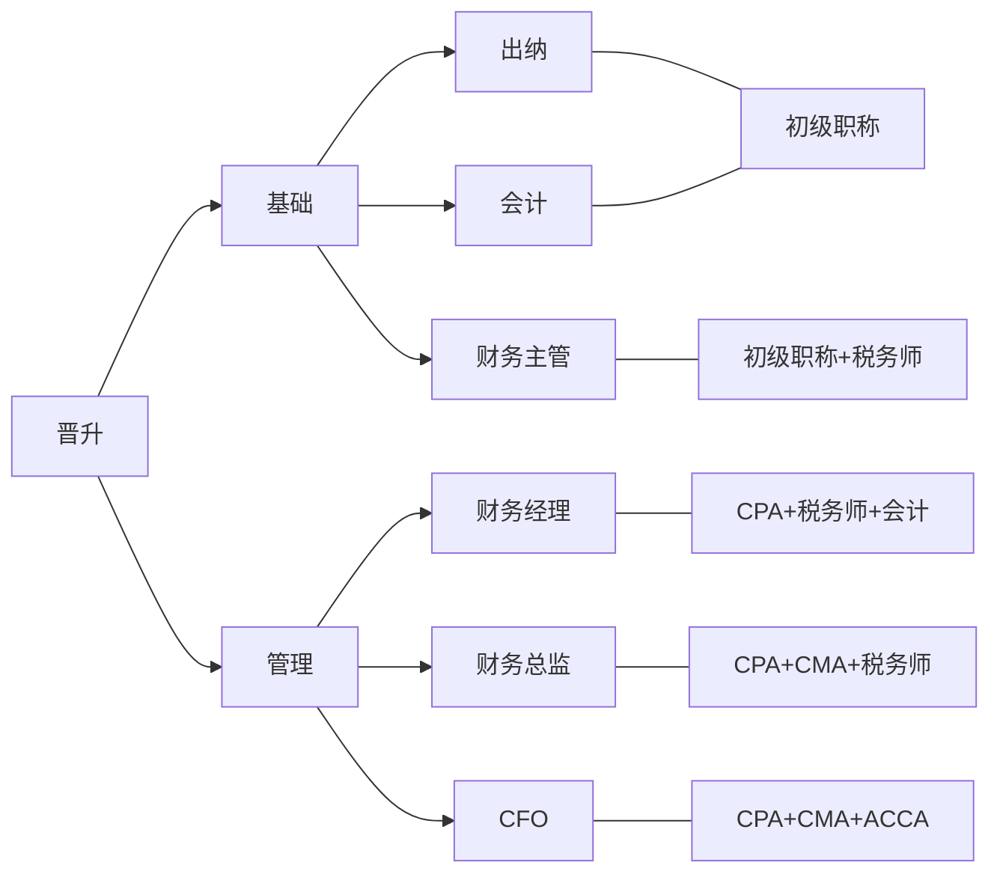
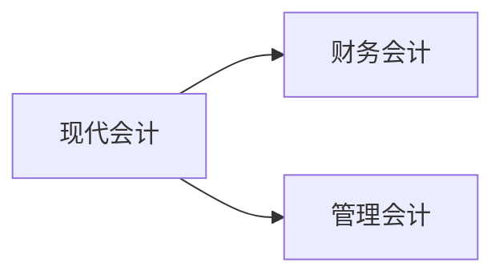
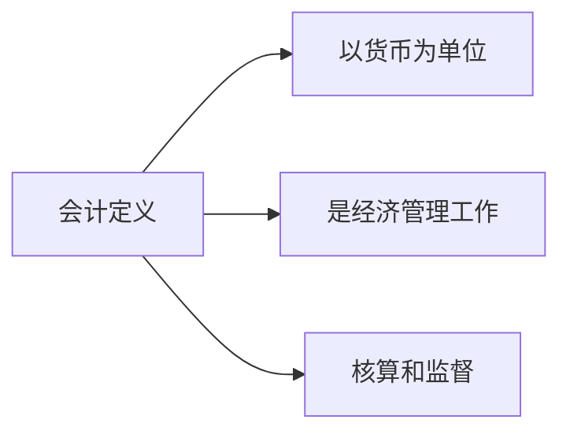
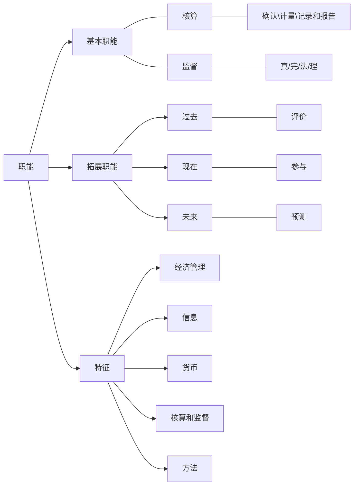
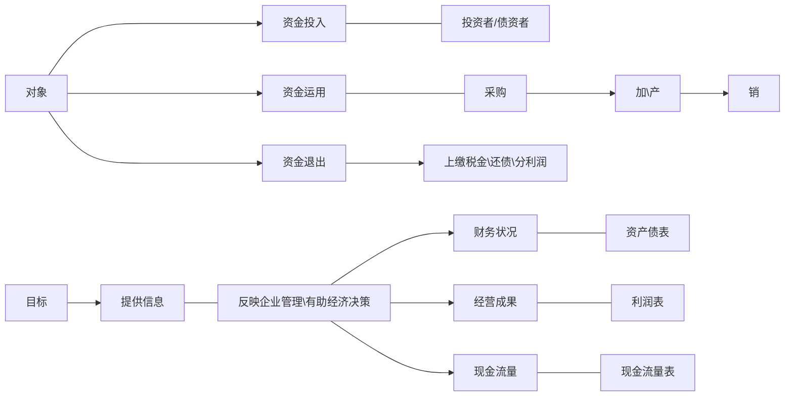
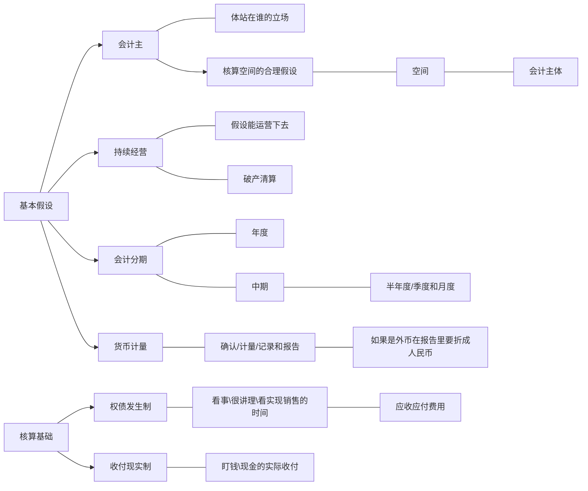
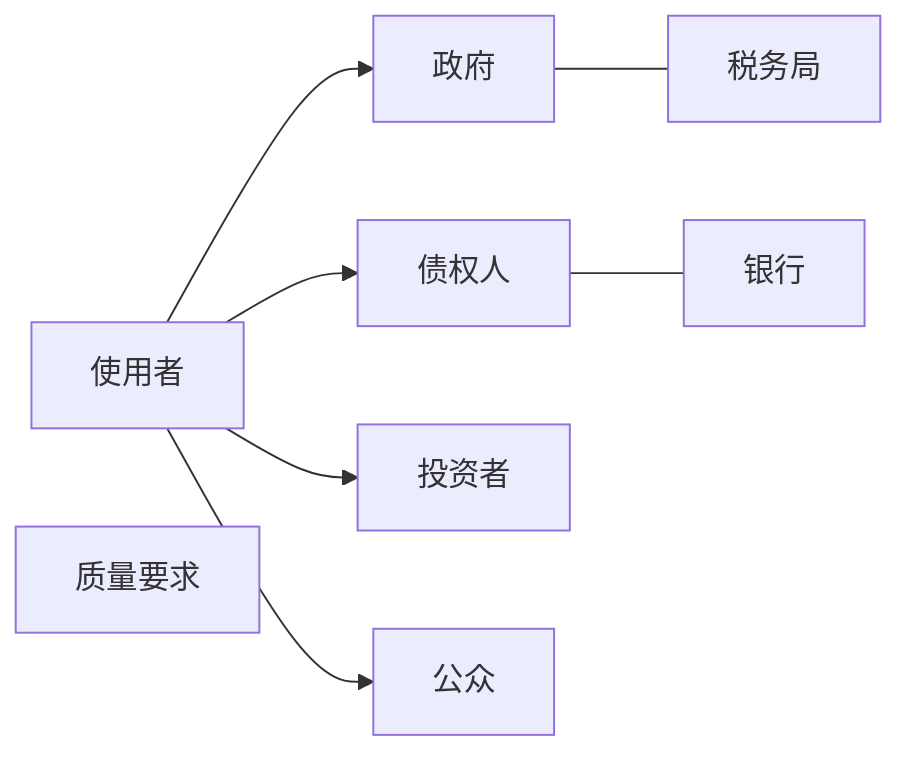

# 会计入门

#### 晋升方向

## 第一章

### 第一节：会计那些事

### 第二节：会计定义、职能

##### 1.会计定义

##### 2.职能

### 第三节：会计对象和目标

### 第四节：会计基本假设和核算基础

### 第五节：会计信息的使用者及质量要求

##### 1.使用者：

- 政府（税务局）
- 债权人（银行）
- 投资者
- 公众

##### 2.质量要求

- 可靠性
  - 实际发生、如是反映
  - 有证据
- 相关性（有用性）
  - 财务状况
  - 经营成果
  - 现金流量
- 可理解性
- 可比性
- 实质重于形式
- 重要性
- 谨慎性
- 及时性

<!-- 加载mermaid，以便GitHub page 展示mermaid -->

<!-- 兼容GitHub -->

<!-- 访问量统计 -->

 | 访问量： 次