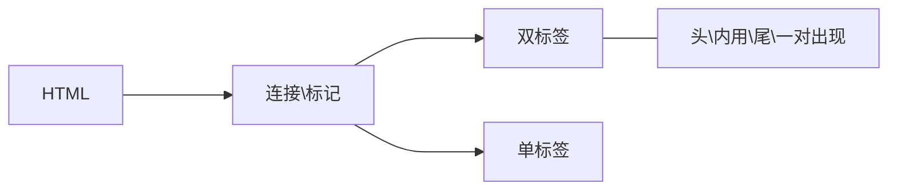

#  前端HTML&CSS基础

## 标签语法



 

```html
<strong>文字内容</strong>
#包裹内容
<hr>
```

## HTML基本骨架

```html
<html>#整个网页
	<head>#头部
		<title>标题</title>#标题
	</head>
		<body>#主体
		主体
		</body>
</html>
```

### 标签之间的关系

- 父子关系（嵌套关系）
- 兄弟关系（并列关系）

### 注释

- 方便理解、查找

```html
<!--内容-->
```

#### 标题标签

- 名字相关的内容可以用标题标签
- 标签名h1~h6（双标签、独占一行）
  - h1只能用一次，网页logo

#### 段落标签

- 新闻段落
- 标签名 p 
  - 双标签
  - 独占一行
  - 段落之间有空白间隙

#### 换行于水平线标签

- 换行 br 
  - 单标签
- 水平线 hr 
  - 单标签

#### 文本格式化标签

- 突出重点

  |  标签  |  注释  |
  | :----: | :----: |
  | strong |  加粗  |
  |   em   |  倾斜  |
  |  ins   | 下划线 |
  |  del   | 删除线 |

   

  - 缩写

  | 标签 |  注释  |
  | :--: | :----: |
  |  b   |  加粗  |
  |  i   |  倾斜  |
  |  u   | 下划线 |
  |  s   | 删除线 |

#### 图像标签-基本使用

- 网页插图
- 单标签

```html

```

##### 图像标签-属性

```html

```

|     属性      |   作用   |            说明            |
| :-----------: | :------: | :------------------------: |
|  alt（常用）  | 替换文本 |    图片显示不了显示文字    |
| title（常用） | 提示文本 | 鼠标悬停在图片上面显示文字 |
|     width     |   宽度   |     值为数字，没有单位     |
|    height     |   高度   |     值为数字，没有单位     |


#### 路径

- 起点到终点经过的路线

  - 相对：当前文件位置
    - 用/ :进入某个文件夹
    - 用 . : 当前文件所在文件夹

  ```html
  
  
  ```

  - 绝对：盘符
  - 文件在线网址
    - 应用场景：友情连接

```html


#图片链接
```

#### 超链接标签

- 跳转到其他网页

```html
<a href="网址、本地文件路径" target="_blank"#新窗口跳转>文字</a>
#跳转本地文件：相对路径查找
<a href="#" #没有链接先放#号>空链接</a>
```

#### 音频标签

- 插入声音

```html
<audio src="音频的url"></audio>
<audio src="音频的url" controls="controls"></audio>
<audio src="音频的url" controls></audio>
#html5属性名和属性值完全一样 可以简写一个单词
```

- 常见属性

  |    属性     |       作用       |           特殊说明           |
  | :---------: | :--------------: | :--------------------------: |
  | src（必须） |     音频url      |   支持格式：mp3、ogg、wav    |
  |  controls   | 显示音频控制面板 |                              |
  |    loop     |     循环播放     |                              |
  |  Autoplay   |     自动播放     | 浏览器一般会**禁用**自动播放 |

#### 视频标签

```html
<video src="视频的url"></video>
```

- 常见属性

|    属性     |       作用       |            特殊说明            |
| :---------: | :--------------: | :----------------------------: |
| src（必须） |     音频url      |    支持格式：mp4、WedM、Ogg    |
|  controls   | 显示音频控制面板 |                                |
|    loop     |     循环播放     |                                |
|    Muted    |     静音播放     |                                |
|  Autoplay   |     自动播放     | 浏览器支持**静音状态**自动播放 |

