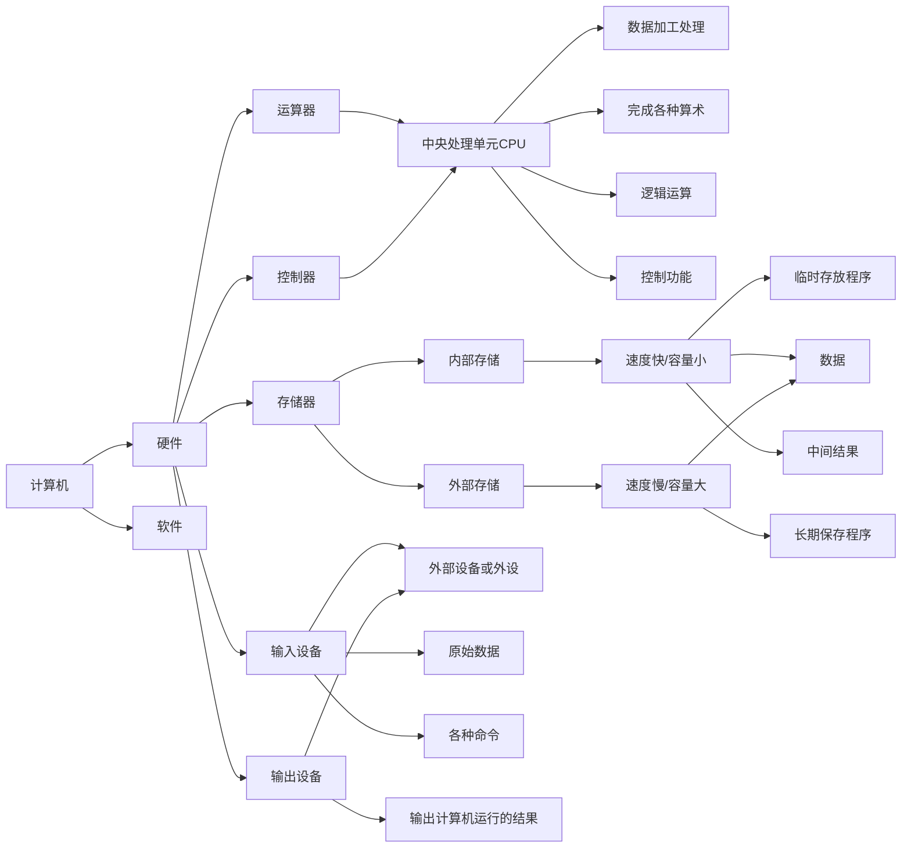
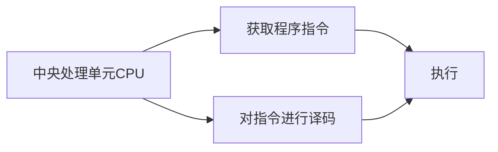
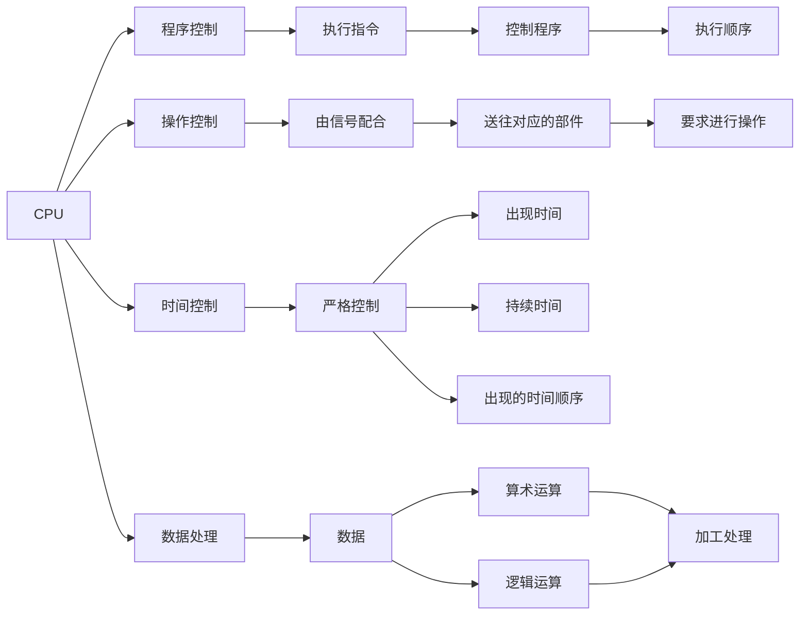

# 软件设计师教程

## 计算机系统基础知识

### 计算机系统硬件基本组成

计算机系统硬件基本组成

- CPU：硬件的系统核心
- 存储器：计算机记忆设备

### 中央处理单元

- CPU➡️是计算机的核心

#### 1.CPU的功能

<!-- 加载mermaid，以便GitHub page 展示mermaid -->

<!-- 兼容GitHub -->

<!-- 访问量统计 -->

 | 访问量： 次
